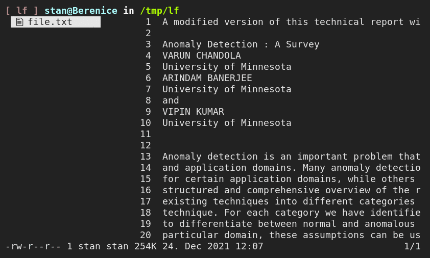

**A collection of useful and nifty use cases and configurations for the lf TUI file manager**

     
     

# 1. Introduction

[lf](https://github.com/gokcehan/lf) is a terminal file manager heavily inspired by ranger. In addition to its core functionality as a generic file management application one of lf's salient features is its shell integration and general hackability. Wielding the powers that come with shells, scripts and environment variables lf's utility and scope of application can be significantly expanded.

The purpose of this project is to showcase configurations of and around lf which extend its core functionality by application of these mechanisms. These *gadgets* include useful additions like graphical overlays for file previews and integration with your interactive shell as well as playful gimmicks such as browsing youtube. See the overview below for a full list.

Please take note that these showcases focus on intelligibility and clarity of intent and their purpose is to inspire ideas rather than to be feature-complete implementations and to be used on their own. To this end the individual gadgets do just as much as necessary to communicate their core idea and use the aforementioned basic mechanisms for the implementation.

# 2. Setup and Installation

The gadgets are organized as self-sufficient and disjunct units. Browse the existing catalog and pick out what you find interesting. Physically, every gadget is a separate directory which includes a README showcasing its functionality, usually with screencasts which Github et al. will happily render. To explore simply click through the directories in your browser.

Should you find something interesting clone the repository, install the configuration as instructed and try it out for yourself. Eventually, it is up to you to weave the functionality into your own setup of lf. This final step is out of this project's scope as the integration depends on your existing setup and on which gadgets you intend to include. For an example of a feature-rich lf setup interweaving multiple gadgets have a look at [my personal configuration](https://github.com/slavistan/lfbundle).

Nevertheless, should you have gotten stuck you can create an issue if you feel a question or a problem you face would be of interest to other people.

## 2.1 Catalog of Gadgets

Here's a brief overview of the existing gadgets. For more detailed information about a specific configuration consult the README in the corresponding subdirectory.

| Gadget              | Description                                                            | Link
| ---                 | ---                                                                    | ---
| lf-shellcd          | Change the working directory of your interactive shell when exiting lf | [🔗](https://github.com/slavistan/lf-gadgets/tree/master/lf-shellcd)
| lf-ueberzug         | Graphical file previews with ueberzug                                  | [🔗](https://github.com/slavistan/lf-gadgets/tree/master/lf-ueberzug)
| lf-scrollingpreview | Scroll the contents of files in the preview pane                       | [🔗](https://github.com/slavistan/lf-gadgets/tree/master/lf-scrollingpreview)
| lf-yt               | Preview and download Youtube search results                            | [🔗](https://github.com/slavistan/lf-gadgets/tree/master/lf-yt)

# 3. Contribution & License

This project in its entirety is licensed under the GPLv3 license, a copy of which is can be found in the LICENSE file.

If you find bugs, deem the documentation to be lacking or have an idea for a gadget yourself please create an issue or a pull request. You are warlmy welcomed to contribute and to voice your ideas.

    𝄽 
    Copyright © 2021 Stanislaw Hüll

