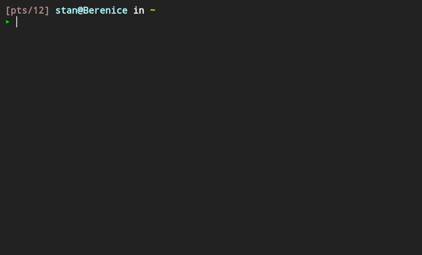

# Preview and Download Youtube Search Results with **lf**



Given an input `lf-yt` searches Youtube and, showing video thumbnails, allows to select videos for preview and download. Downloads are saved to *~/.lf-yt*.

## Usage

Export your Youtube API-key to the environment variable *YT_API_KEY* or store it inside the file *~/.youtube.apikey*. Then open a terminal and run a search query, e.g. `lf-yt Chopin`.

## Installation

Prerequisites:

+ A youtube API-key
+ zsh
+ ueberzug
+ mpv
+ youtube-dl

From inside this subdirectory run these instructions as a regular user:

```
sudo cp lf-yt lf-yt-previewer lf-yt-cleaner /usr/local/bin
mkdir -p "$HOME/.config/lf-yt"
cp lfrc-yt "$HOME/.config/lf-yt"
```

This will yield the following directory structure:

```
 /usr/local/bin
├─  lf-yt
├─  lf-yt-cleaner
└─  lf-yt-previewer

 $HOME/.config
└─  lf-yt
   └─  lfrc-yt
```

To **uninstall** simply delete the newly created files.
